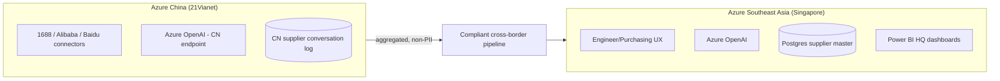

# AP Tech AI Purchasing Agent — Refined Proposal v2

> **Companion to the polished .docx deliverable.** This file is the working markdown — same content, with renderable Mermaid diagrams the docx cannot embed natively. Use this for vault search, NotebookLM ingestion, and quick reference.

---

## Strategic delta from v1 (PDF)

| Aspect | v1 (Ken's PDF, May 2026) | v2 (this proposal) |
|---|---|---|
| Tech stack | Generic open-source (FastAPI / Celery / PostgreSQL / SerpAPI / React) | Microsoft-native (Azure OpenAI GPT-4o / Azure Functions / Postgres / Bing / Teams) |
| Procurement path | New vendors, new auth, new infra review | Inside existing Azure tenant + Entra ID — no new SaaS |
| Orchestration | Python services | n8n + Power Automate hybrid (custom CN connectors + M365-native flows) |
| CN sourcing | "Custom" | Azure China (21Vianet) tenant; AP Tech Xiamen license already held |
| Engineer interface | React chat | Microsoft Teams via Microsoft Agent 365 (@PurchasingBot) |
| Pricing | Not specified | Calibrated against 2026 SG market: SGD 32K Phase 1, ~SGD 146.5K full programme, ~SGD 73K after EDG grant |
| Risks flagged | 5 (their §6) | 5 + 3 new medical-context risks (unqualified CN suppliers, spec translation, Azure China timing) |

---

## 1. We Read Your Document — Confirmed

- **5-phase process** (Request → Inquiry → Confirmation → Tracking → Fulfilment) — confirmed.
- **4 inefficiencies** (Manual relay, sequential bottleneck, slow outreach, manual tracking) — confirmed verbatim from §3.1.
- **Evidence**: 30+ emails per PO, Mar 2 → Mar 17 (15-day cycle). Not relitigating.
- **KPI targets from §5.5** — inherited as acceptance criteria, not softened.

---

## 2. Current vs Proposed Process Flow

```mermaid
flowchart LR
  subgraph Current ["CURRENT (sequential, 30+ emails, 2 weeks)"]
    E1[Engineer] -->|email| P1[Purchasing]
    P1 -->|email| S1[Supplier]
    S1 -->|question| P1
    P1 -->|forward| E1
    E1 -->|answer| P1
    P1 -->|forward| S1
  end
  subgraph Proposed ["PROPOSED (parallel, 3-5 emails, 2-3 days)"]
    E2[Engineer] -->|@PurchasingBot in Teams| AI[Purchasing Agent]
    AI -->|parallel outreach| S2a[Supplier A]
    AI -->|parallel outreach| S2b[Supplier B]
    AI -->|parallel outreach| S2c[Supplier C]
    S2a -->|reply| AI
    S2b -->|reply| AI
    S2c -->|reply| AI
    AI -->|quote comparison + recommendation| P2[Purchasing]
    P2 -->|one-click approve| AI
  end
```

---

## 3. Microsoft-Native Architecture

```mermaid
flowchart TB
  Eng[Engineer in Teams] --> Agent["Microsoft Agent 365: @PurchasingBot"]
  Pur[Purchasing in Teams] --> Agent
  Agent --> PA[Power Automate flows]
  Agent --> N8N[n8n self-hosted]
  PA --> Graph[Microsoft Graph API]
  PA --> SP[SharePoint / Teams approvals]
  N8N --> AO["Azure OpenAI - GPT-4o, SG region"]
  N8N --> SB[Azure Service Bus]
  N8N --> DB[("Azure Postgres + pgvector")]
  N8N --> Bing[Bing Web Search API]
  N8N --> CN["1688 / Alibaba / Baidu via Azure China"]
  Graph --> Mail[purchasing-ai@aptech.com]
  AO --> Mail
  N8N --> Log["Azure DevOps Git: markdown PO logs"]
  DB --> PBI["Power BI: quote comparison + PO status"]
```

### Validated technical facts (May 2026)

- **Azure OpenAI GPT-4o (Global Provisioned-managed) is live in Singapore region** as of January 2025. GPT-4 legacy is NOT supported in SEA — use GPT-4o.
- **Azure China and Azure Global are architecturally disconnected** by design. Correct pattern: two independent stacks connected via APIs only.
- **AP Technologies (Xiamen) Co., Ltd. already holds the Chinese Business License** required for Azure China (21Vianet) tenant setup — no entity formation blocker.
- **Cross-border sync latency ~3× intra-region.** Analytics-only sync (aggregated, non-PII) is the correct pattern — Chinese supplier conversation data stays in China.
- **Azure China tenant setup with 21Vianet takes 2–4 weeks** — must initiate at Phase 2 kickoff (Week 7), not Week 11.

---

## 4. Singapore + Azure China Bridge



---

## 5. Nine Requirements → Microsoft Service Map

| # | Requirement (AP Tech §4.4) | Microsoft / Azure service | Phase |
|---|---|---|---|
| 1 | Parallel processing of POs | Azure Service Bus + Functions; Teams surface | Phase 1 (MVP) |
| 2 | Exhaust all potential suppliers | Postgres (supplier DB) + Bing Web Search + n8n CN connectors + Azure OpenAI translation | Phase 2 |
| 3 | Negotiate on behalf of team | Azure OpenAI prompt patterns; Power Automate approval gates; Phase 3 conditional autonomy | Phase 3 |
| 4 | Central point of communication | Microsoft Graph API mailbox + Teams routing via Power Automate | Phase 1 (MVP) |
| 5 | Automated follow-ups | Power Automate scheduled flows + n8n stateful escalation | Phase 2 |
| 6 | Chinese internet sourcing | 1688 / Alibaba / Baidu via Azure China (21Vianet) | Phase 2 |
| 7 | Query internal supplier DB | Azure Data Factory or Functions connector; Postgres fallback | Phase 1 (MVP) |
| 8 | Operate dedicated email account | Microsoft Graph API + Exchange Online mailbox | Phase 1 (MVP) |
| 9 | Markdown conversation retention | Azure DevOps Git or SharePoint with IRM; PDF export | Phase 1 (MVP) |

---

## 6. Commercial — Market-Calibrated

| Phase | Duration | Price (SGD) | After EDG 50% |
|---|---|---|---|
| Phase 0 — Proof of Read | Days 1–3 | **0 (free)** | 0 |
| Phase 1 — MVP Pilot | 6 weeks | **32,000** | 16,000 |
| Phase 2 — Enhanced (parallel + CN) | Weeks 7–12 | **39,000** | 19,500 |
| Phase 3 — Intelligent (negotiation + ML) | Weeks 13–20 | **35,500** | 17,750 |
| Phase 4 — Scale | Weeks 21+ | ~40,000 | ~20,000 |
| **Full programme** | ~5 months | **~146,500** | **~73,250** |

### Phase 1 milestone payments

- 30% on contract sign — SGD 9,600
- 40% on Week 3 (Parser + Email Draft delivered) — SGD 12,800
- 30% on Week 6 (end-to-end pilot + measured improvement) — SGD 9,600

### Pilot guarantee

If at Week 6 the pilot has not demonstrably reduced time-from-request-to-first-supplier-email versus baseline, the final 30% milestone (SGD 9,600) is waived.

### EDG note

- AP Technologies (Singapore entity) qualifies under EDG "Innovation and Productivity" category.
- 4–8 week application window; does not block project start.
- Recommend initiating at Phase 1 contract sign. KTG provides the structured project proposal document at no extra cost.

---

## 7. New Risks Beyond Their §6 Table (Medical-Device Context)

1. **Unqualified CN suppliers in Phase 2.** "1688 supplier" ≠ "ISO 13485-approved vendor." Architectural mitigation: hard filter — any supplier not in approved vendor list goes to "Potential Vendor" bucket for qualification review, never primary recommendation. Tze Han Yap retains gatekeeper role.

2. **Spec translation in CN sourcing.** "Medical grade" in 1688 does not mean ISO 13485. Every CN-sourced supplier carries automatic disclaimer flag; manufacturing-terminology prompt-engineering against AP Tech's polymer / catheter taxonomy built in Week 2–3.

3. **Azure China tenant setup timing.** 2–4 weeks for license verification + 21Vianet onboarding. Initiated Phase 2 kickoff (Week 7), in parallel with parallel-outreach build, so CN sourcing is unblocked by Weeks 11–12.

---

## 8. Stakeholder Map (Confirmed Names)

| Role | Name | Tenure | Where they sit |
|---|---|---|---|
| Procurement Director | **Tze Han Yap** | 25+ years supply chain | Singapore HQ |
| Sourcing & Procurement Manager | **Weihang W.** | 11 years indirect materials | Singapore |
| Technical contact for this proposal | **Ken Ng** | (from email) | apgroup7373.onmicrosoft.com domain |
| CEO & Co-Founder | Charles Tang | Founder, 2013 | Singapore HQ |
| Strategy & Technology Director | Sean L. Tang | Cross-site QMS | Singapore HQ |
| Chief Commercial Officer | Russell Nagy | Appointed 2026 | Singapore HQ |
| Non-Executive Director | Till Vestring | Former Bain SEA Managing Partner | Board |

---

## 9. One-Line Framing — for every conversation

> "It stops your purchasing team from being a relay station. Technical questions go directly to engineers. Commercial questions go directly to purchasing. Every email gets logged automatically. And you never lose track of a PO again — even the ones sitting in someone's inbox in Xiamen."

That is the whole pitch. Everything else is implementation detail.

---

## Cross-references in this vault

- `clients/AP-tech/APTech-Process-Automation-Project.md` — broader S$195-295K, 10-process SOW
- `clients/AP-tech/APTech-Centralized-Intranet-Architecture.md` — SharePoint + n8n + Fabric platform architecture
- `clients/AP-tech/notebooklm-extract-2026-05-12.md` — research extract incl. detailed n8n workflow
- `clients/AP-tech/AP Tech AI Purchasing Agent — Validated Proposal & Pricing Guide.docx` — Plexity research used to calibrate this proposal
- `clients/AP-tech/AP_Tech_Purchase_Process_Analysis.pdf` — Ken's source document (v1)
- `clients/AP-tech/2026-05-12-Ken-warm-reply.md` — 1-page warm-reply alternative for tonight's send

---

## Open questions for Kev before send

- [ ] Send the full proposal v2, OR send the 1-page warm reply first and follow up with the proposal after the call?
- [ ] Reply from `kevin.pl.tan@gmail.com` or `kevinktg@goodai.au`? (Ken sent to `kevinktg@outlook.com`.)
- [ ] EDG grant — does AP Tech (Singapore entity) want KTG to draft the application document, or do they prefer their own consultant?
- [ ] Singapore HQ address from Plexity research (8 Buroh Street) — confirm before mentioning in any outbound copy in case it's been updated.
