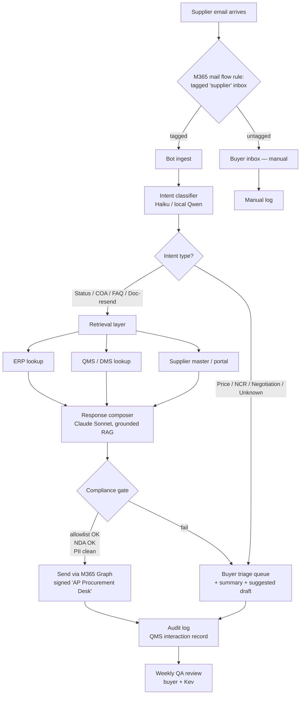
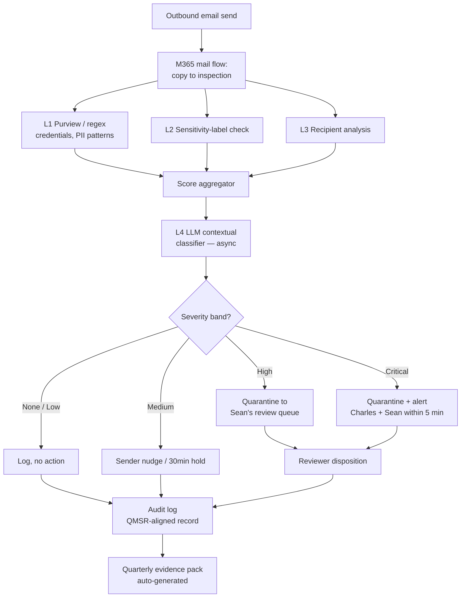

# Process Flows · RACI · SLAs

## A. Phase 1 — Supplier Chatbot · End-to-End Flow

### Phase 1 — Decision points

| # | Question | Logic |
|---|---|---|
| 1 | Is this email from a supplier? | M365 sender domain on supplier master |
| 2 | What's the intent? | Classifier; fall back to buyer if confidence < 0.85 |
| 3 | Is the request answerable from grounded data? | If retrieval returns empty → escalate, never fabricate |
| 4 | Is the recipient/sender on a restricted list? | Allowlist check (NDA suppliers, single-source) |
| 5 | Does the response touch a regulated topic (NCR, deviation)? | If yes → always escalate |

### Phase 1 — Failure modes & fallbacks

| Failure | Behaviour |
|---|---|
| ERP API down | Bot replies "checking with the team — back to you within the hour"; routes to buyer |
| Classifier confidence low | Routes to buyer's triage queue with suggested draft (don't auto-send) |
| Compliance gate blocks | Escalates to buyer + flags reason ("recipient not on allowlist for drawing X") |
| Supplier replies in non-English | Routes to buyer immediately |

---

## B. Phase 2 — Email Compliance · End-to-End Flow

### Phase 2 — Decision points

| # | Question | Logic |
|---|---|---|
| 1 | Is the email outbound? | Inbound-only and internal-only skip the pipeline (v1) |
| 2 | Did L1 catch a deterministic pattern? | If yes → severity ≥ Medium minimum |
| 3 | Does the attachment have a Confidential / Restricted label? | If yes + external recipient → severity ≥ High |
| 4 | Is the recipient an external domain not in the customer/partner list? | Modulator on severity |
| 5 | Does L4 LLM say this is an IP/PII/ITAR leak? | Final severity decision; reasoner output logged |
| 6 | Is the sender at the Irvine site + content ITAR-flagged + recipient non-US? | → Critical, regardless of other layers |

### Phase 2 — Failure modes & fallbacks

| Failure | Behaviour |
|---|---|
| LLM classifier down / over budget | L1-L3 still run; system degrades to deterministic-only; flag visible in audit log |
| Reviewer queue overflow | Auto-prioritise by severity; medium-band nudges become silent log entries |
| False positive — sender appeals | Email releases; appeal logged for FP-rate tracking |
| Pipeline outage | Mail flows normally (fail-open); incident logged for review — v1 design choice, revisited if FP/TP rate stable enough for fail-closed |

---

## C. RACI — Phase 1 (Supplier Chatbot)

| Activity | Charles | Sean (QMS) | Russell | Buyer team | Kev (KTG) | Bot |
|---|---|---|---|---|---|---|
| Approve scope & go-live gates | A | C | I | C | R | — |
| Architecture decisions | I | C | I | I | R/A | — |
| ERP / QMS API access | I | R | I | C | A | — |
| Build & deploy | I | I | I | C | R/A | — |
| Daily operation | I | I | I | R | C | R |
| Audit-trail review | A | R | I | C | C | — |
| FP/TP weekly QA | I | C | I | R | A | — |
| Supplier-facing escalation | I | I | C | R/A | C | — |

## D. RACI — Phase 2 (Compliance Bot)

| Activity | Charles | Sean (QMS) | Legal/DPO | IT | Russell | Kev (KTG) | Bot |
|---|---|---|---|---|---|---|---|
| Approve scope & go-live | A | R | C | C | I | C | — |
| PDPA / PIPL / ITAR posture | A | C | R | I | I | C | — |
| M365 / Purview config | I | C | I | R | I | A | — |
| LLM classifier tuning | I | C | I | I | I | R/A | — |
| Reviewer queue ops | I | R/A | I | I | I | C | — |
| Critical-band escalation | A | R | C | I | I | C | R |
| Quarterly audit pack | A | R | I | I | I | C | R |
| FP appeals | I | A | I | I | I | C | — |

(R = Responsible, A = Accountable, C = Consulted, I = Informed)

---

## E. SLAs (proposed — confirm with AP Tech)

### Phase 1
| Event | SLA |
|---|---|
| Tier-1 supplier email auto-response | < 5 min median, < 30 min p99 |
| Escalation to buyer (medium-confidence intent) | Within 15 min, with summary + suggested draft |
| ERP/QMS lookup failure recovery | < 1 hr (bot defers to human in interim) |
| Audit-log write completeness | 100%; daily reconciliation |

### Phase 2
| Event | SLA |
|---|---|
| L1-L3 deterministic pipeline latency | < 200 ms p95 |
| L4 LLM classifier latency | < 1 s p95 (async) |
| Critical-band alert to Charles + Sean | < 5 min from send |
| Reviewer disposition on High band | < 4 business hours |
| FP appeal release | < 1 business hour |
| Quarterly evidence-pack delivery | T+5 business days after quarter close |

---

## F. Escalation Paths

### Phase 1
1. Bot fails compliance gate → buyer
2. Buyer can't resolve in 24 hr → procurement lead
3. Procurement lead → Russell (commercial impact) or Sean (QMS impact)
4. Russell / Sean → Charles only for material commercial / regulatory exposure

### Phase 2
1. Medium / High → Sean's queue
2. Critical → Charles + Sean immediate
3. ITAR-flagged + Irvine-sourced → designated US-person reviewer + Charles
4. PDPA / regulatory inquiry → Legal/DPO + Charles

---

## G. Exception Handling Principles

- **Bias to escalate, never fabricate.** The bot saying "I don't know — a buyer will be back to you" is always acceptable. The bot inventing an answer is never acceptable.
- **Fail open on the chatbot, fail safe on the compliance bot.** Phase 1 outage = manual handling, no harm. Phase 2 outage = email continues to flow (don't break the business), incident logged for review.
- **Right of appeal, always.** Senders can challenge any flag. Suppliers can request human reply on any auto-response.
- **Audit everything; log enough to defend, not enough to surveil.** Capture the decision and its evidence; don't capture personal context that's not relevant to the decision.

---

*Process flows v0.1 — refine after Charles validates §5 of brainstorm doc.*
