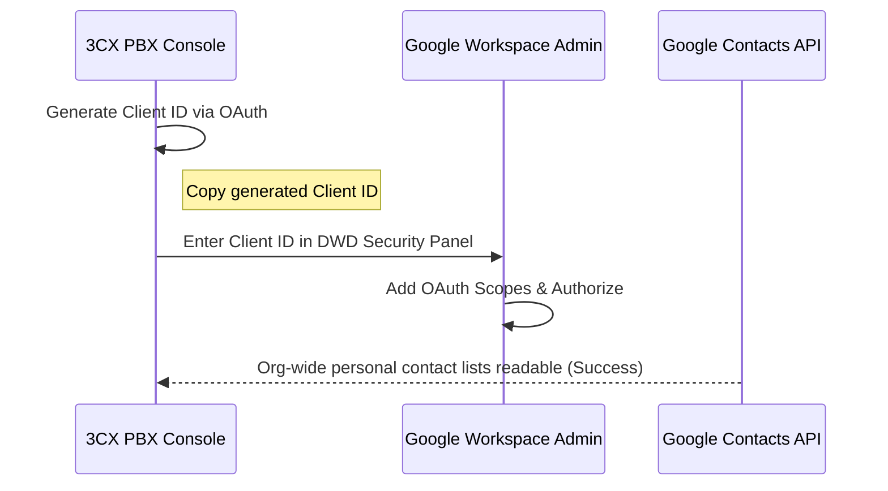

# 📞 3CX v20 x Google Workspace Integration Runbook
**Target Client**: Kismet Finance Group  
**Architect**: Good AI  
**Last Updated**: 2026-05-26 (Compliance Sync: 19 Feb 2025 Live 3CX Docs)

---

## 🚀 Executive Summary

This runbook provides the definitive, production-tested procedure for connecting **3CX v20 U5** with **Google Workspace**. It corrects major legacy documentation errors (such as the automated app-creation myth) and outlines the **mandatory Domain-wide Delegation (DWD) steps** required to prevent silent contact and user sync failures.

> [!NOTE]
> All procedures in this runbook are verified against the active 3CX official documentation.

---

## 🛠️ System Prerequisites & Gateways

Before initiating the OAuth flow, ensure the following settings are active in your Google Admin and 3CX consoles:

| Parameter | Requirement | Status / Context |
| :--- | :--- | :--- |
| **3CX Version** | **V20 Update 5 (U5) or higher** | Mandatory minimum version for GWS integration |
| **Google Admin Role** | **Super Admin** | The authenticating account *must* hold this role org-wide |
| **Billing Admin** | **Required for Storage/Transcription** | Optional if only performing User & Personal Contact Sync |
| **Match Digits** | **7 Digits (Default)** | Standard phonebook matching recommendation |

---

## ⚡ Step-by-Step Integration Protocol

### Step 1: Feature Selection in 3CX
1. Log in to your **3CX Admin Console**.
2. Navigate to **Integrations** ➔ **Google** ➔ **Configure**.
3. *Do not click connect yet.* First, select your desired integration toggles on the UI:
   - [x] **User Sync** (Syncs GWS users to 3CX extensions)
   - [x] **Sync Personal Contacts** (Syncs each user's personal Google Contacts to their 3CX personal phonebook)
   - [ ] **Calendar / Storage / Transcription** (Toggle based on licensing/needs)

### Step 2: The Google OAuth Consent Flow
1. Click **Connect**.
2. You will be redirected to the secure Google OAuth portal.
3. Authenticate using your Google **Super Admin** credentials.
4. Review the permissions and grant authorization on behalf of the organization.

> [!CAUTION]
> **The Myth of Automatic App Creation:**
> Legacy documentation states that the 3CX wizard automatically creates the Google Workspace application and fully configures it. **This is false.** The integration page will generate a **Client ID** that you must manually authorize using Domain-wide Delegation. Failing to do Step 3 will result in a silent failure where the integration status shows active but no data is synced.

---

### Step 3: Mandatory Google Domain-wide Delegation (DWD) 🔑

This is the critical step omitted from older runbooks. It grants the 3CX Client ID organizational permission to read GWS user directories and personal contact lists.



1. Copy the **Client ID** displayed in your 3CX Admin Console after completing the OAuth flow.
2. Open a new tab and log in to the **Google Admin Console** (`admin.google.com`).
3. Navigate to: **Security** ➔ **Access and data control** ➔ **API controls** ➔ **Domain-wide delegation**.
4. Click **Add new** to register a new API client.
5. Paste the **Client ID** you copied from 3CX.
6. In the **OAuth Scopes** field, paste the following comma-separated list of scopes (depending on features enabled):
   ```text
   https://www.googleapis.com/auth/admin.directory.user.readonly,
   https://www.googleapis.com/auth/admin.directory.group.readonly,
   https://www.googleapis.com/auth/contacts,
   https://www.googleapis.com/auth/calendar
   ```
7. Click **Authorize** to save.

---

### Step 4: Configure User & Contact Syncing
1. Return to the **3CX Admin Console**.
2. Go to **Users** ➔ Click the **Google** sync button.
3. Under the user sync configuration panel, locate **Sync Options** and enable **"Sync Personal Contacts"**.
4. Save the configuration.

---

## 📈 Integration Capabilities & Architectural Boundaries

Understand the technical limitations of this integration to align user expectations:

*   **Personal Phonebook ONLY**: 3CX only syncs each user's **personal Google Contacts** (located in Google's *My Contacts* category) to their 3CX personal phonebook. 
*   **No Company-wide Shared Sync**: 3CX does *not* sync shared Google Directory/Company contacts. The official 3CX specification explicitly notes: *"Company contacts do not exist"* in this interface. Shared team lists must be imported as a CSV file to the 3CX Company Phonebook.
*   **Sync Frequency**: One-way (Google Workspace ➔ 3CX). This sync executes **immediately on save, and then nightly**. It is **not configurable** due to Google API limitations regarding change listener subscriptions on personal contact lists.

---

## 🔍 Troubleshooting & Failure Matrix

> [!WARNING]
> If the integration compiles with zero errors but nothing syncs, check the Domain-wide Delegation (DWD) settings first.

| Symptom / Error | Root Cause | Remediation Action |
| :--- | :--- | :--- |
| **"Permission Denied" during OAuth** | Authenticating user is not a Google Workspace **Super Admin**. | Ensure the account holds the Super Admin role in `Users -> Admin roles and privileges` within GWS. |
| **Silent Sync Fail (Status active, 0 contacts synced)** | Missing Domain-wide Delegation (DWD) authorization. | Complete **Step 3** of this runbook in `admin.google.com` using the correct Client ID. |
| **Individual contact missing in 3CX** | Contact is not in user's personal "My Contacts". | Move the contact out of "Other Contacts" or shared groups and place it directly into the user's personal Google **My Contacts** folder. |
| **Mobile Contacts not showing** | Native OS contacts sync not enabled on smartphone. | On iOS/Android, go to 3CX App Settings ➔ Enable **"Sync Device Contacts"** to allow local device address book bridging. |
