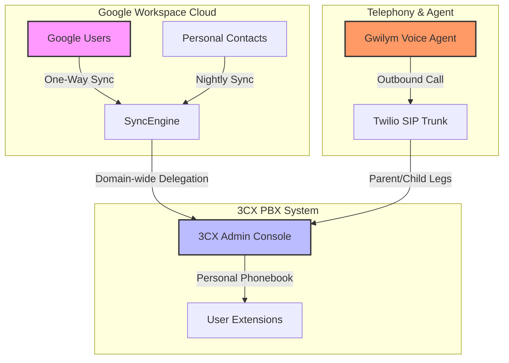

> [!success] COMPILED KNOWLEDGE · Karpathy LLM Wiki Pattern
> Compiled from immutable source: `[[wiki/sources/clients/kismet-finance/3cx-perplexity-research]]`  
> Integrates: `[[wiki/clients/kismet-finance]]` · `[[wiki/projects/goodai-voice]]` (Gwilym Mc'Agentmouth) · `[[wiki/projects/gws-cli]]` (Google Workspace CLI)

# 📞 3CX v20 x Google Workspace Integration Guide

This guide establishes the canonical technical workflow for syncing **Google Workspace (GWS)** user accounts and personal contact books with **3CX v20 Update 5 (U5) or higher** at **Kismet Finance Group**.

---

## 🏗️ Architectural Flow

The 3CX integration routes phonebook sync and call signaling in a secure closed loop. In KFG's pipeline, **Gwilym Mc’Agentmouth** (built in `[[wiki/projects/goodai-voice]]`) places outbound batch feedback calls using Twilio SIP endpoints, while 3CX utilizes GWS domain integrations to map internal user extensions and personal contacts.



---

## 🛠️ Mandatory Configuration Steps

> [!IMPORTANT]
> **Super Admin Role Requirement:** The user authenticating the OAuth flow *must* hold the **Super Admin** role in the Google Workspace Admin Console (`Directory -> Users -> Admin roles and privileges`).

### Step 1: Feature Selection & OAuth Init
1. In the **3CX Admin Console**, navigate to: **Integrations** ➔ **Google** ➔ **Configure**.
2. On the integration page, select the following features:
   - [x] **User Sync** (Syncs GWS directory users to 3CX extensions)
   - [x] **Sync Personal Contacts** (Required for personal phonebooks)
3. Click **Connect** and authenticate with the Google Super Admin account.

### Step 2: Google Domain-wide Delegation (DWD) 🔑
*The 3CX wizard **does not** automatically authorize the GWS integration. You must manually add the Client ID to Domain-wide Delegation in the Google Admin Console to prevent silent sync failure.*

1. Copy the **Client ID** generated on the 3CX integration page after OAuth completes.
2. Open a new tab, navigate to the **Google Admin Console** (`admin.google.com`).
3. Navigate to: **Security** ➔ **Access and data control** ➔ **API controls** ➔ **Domain-wide delegation**.
4. Click **Add new** and configure:
   - **Client ID**: Paste your 3CX Client ID.
   - **OAuth Scopes**: Enter the following list of comma-separated scopes:
     ```text
     https://www.googleapis.com/auth/admin.directory.user.readonly,
     https://www.googleapis.com/auth/admin.directory.group.readonly,
     https://www.googleapis.com/auth/contacts,
     https://www.googleapis.com/auth/calendar
     ```
5. Click **Authorize** to save.

### Step 3: Activate User and Contact Syncing
1. Return to the **3CX Admin Console**.
2. Navigate to: **Users** ➔ Click the **Google** button.
3. In **Sync Options**, enable **"Sync Personal Contacts"**.
4. Click **Save** to trigger the initial sync.

---

## 📊 Feature Matrix & Known Boundaries

| Capability / Boundary | Status | Technical Details |
| :--- | :--- | :--- |
| **User Directory Sync** | **One-Way (GWS ➔ 3CX)** | Directory users map to 3CX extensions. Syncs on save and nightly. |
| **Personal Contact Sync** | **Personal Phonebook Only** | Syncs contacts located in the user's personal Google **"My Contacts"** list. |
| **Shared / Company Sync** | **UNSUPPORTED** | 3CX does *not* sync shared Google Directory/Company contacts. *"Company contacts do not exist"* in GWS sync. |
| **Sync Frequency** | **Daily (Overnight)** | Hard Google API limitation. There is no real-time webhook listener available for GWS personal contacts, forcing a nightly batch poll. |
| **Caller ID Digit Matching** | **7 Digits Recommended** | Recommended default setting in 3CX Phonebook configuration. |

---

## 🔍 Troubleshooting Sync Failures

> [!WARNING]
> If the integration compiles with zero errors but no contacts appear in the 3CX phonebook, check the Domain-wide Delegation (DWD) settings first.

*   **Symptom**: "Permission Denied" during OAuth flow.
    *   *Root Cause*: Authenticating Google account lacks Super Admin permissions.
    *   *Solution*: Assign Directory Super Admin role to the GWS user.
*   **Symptom**: Integration completes successfully but nothing syncs.
    *   *Root Cause*: Missing DWD authorization step in Google Admin.
    *   *Solution*: Complete **Step 2** of this guide.
*   **Symptom**: Specific contact in Google Contacts is missing in 3CX.
    *   *Root Cause*: The contact is in "Other Contacts" or a shared labels group.
    *   *Solution*: Move the contact directly into the personal **"My Contacts"** list.

---

## 🔗 Connections & Navigation
*   **Main Client Hub**: `[[wiki/clients/kismet-finance]]`
*   **Google Integration CLI**: `[[wiki/projects/gws-cli]]`
*   **Voice Engine**: `[[wiki/projects/goodai-voice]]`
*   **Raw Source Material**: `[[wiki/sources/clients/kismet-finance/3cx-perplexity-research]]`

---
*Back to [[wiki/clients/kismet-finance]]*  
*Back to [[_index]]*
