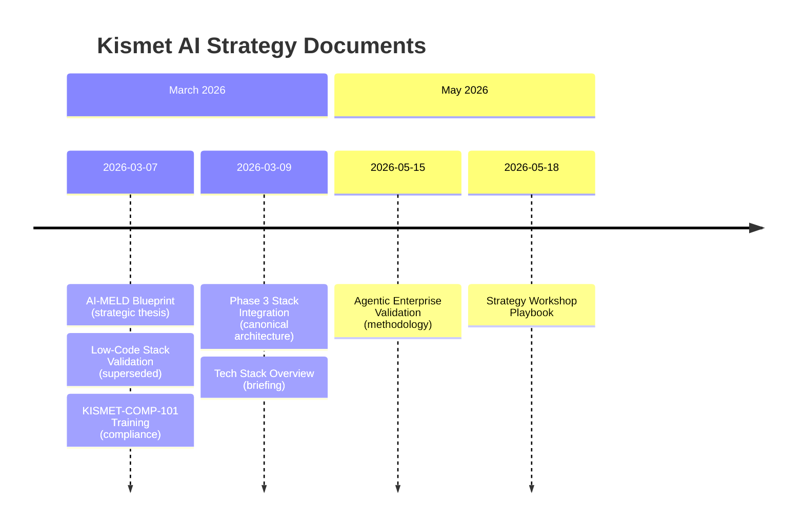

# Kismet AI Strategy — Document Lineage

> [!abstract]
> Chronological narrative of how the Kismet engagement was framed, validated, and operationalized between March and May 2026. Use this as the **map of content** when navigating the seven Kismet AI-strategy documents ingested 2026-05-25.

## Timeline

## Lineage table

| Date | Document | Layer | Status | Key contribution |
|------|----------|-------|--------|------------------|
| 2026-03-07 | [[kismet-ai-meld-blueprint]] | Strategy | active | B2B Referral Hub framing; "application-ready clients" thesis |
| 2026-03-07 | [[kismet-lowcode-stack-validation]] | Architecture | **superseded** | Airtable + GWS + Make.com TCO argument |
| 2026-03-07 | [[kismet-comp-101-training]] | Operations | active | Golden Rules; 2-min/60-min/24-hr enforcement cadence |
| 2026-03-09 | [[kismet-phase3-stack-integration]] | Architecture | **canonical** | n8n + Notion + Slack MCP + JustCall stack; APRA/PRIS/AUSTRAC alignment |
| 2026-03-09 | [[kismet-tech-stack-overview]] | Briefing | active | Stakeholder-grade simplified summary of Phase 3 |
| 2026-05-15 | [[kismet-agentic-enterprise-validation]] | Methodology | active | Diagnostic Discovery, Traffic Light Report, G.U.A.R.D.I.A.N.S. memory |
| 2026-05-18 | [[kismet-strategy-workshop]] | Workshop | active | Personality Bottleneck; Perth Anomaly; 3-phase workshop architecture |

## The thread (one paragraph)

The **AI-MELD Blueprint** establishes the strategic premise: Kismet's growth is bottlenecked at its referral partners, not its own pipeline; Good AI's role is to deliver "application-ready clients." Two **same-day companions** explore the *how* — a now-superseded **low-code validation** (Airtable / Make.com) and a still-active **compliance training** that codifies Golden Rules with hard system enforcement. Within 48 hours the architecture pivots to the **Phase 3 stack** (n8n + Notion + Slack MCP + JustCall) — driven by data sovereignty and 2026 agentic-readiness — with a **stakeholder briefing** sibling. Two months later, the engagement re-anchors in the **Agentic Enterprise / Diagnostic Discovery** methodology (Traffic Light Report, G.U.A.R.D.I.A.N.S. memory framework), and the **Strategy Workshop** playbook gives Good AI a sellable facilitation product layered on top of that methodology.

## Concepts introduced across the corpus

> [!example] Cross-document concept map
> - **B2B Referral Hub** — Blueprint → Workshop (operationalized)
> - **Personality Bottleneck** — Blueprint (implicit) → Workshop (named)
> - **Application-Ready Client** — Blueprint (unit of value) → Phase 3 (delivery mechanism)
> - **Regulatory Fortress** — COMP-101 (training) ⟷ Phase 3 (architecture). Tech + people together.
> - **Diagnostic Discovery / Traffic Light Report** — Validation (2026-05-15) → cross-pollination candidate for `[[wiki/frameworks/business-process-discovery]]`
> - **G.U.A.R.D.I.A.N.S. Persistence** — Validation. Episodic / Semantic / Procedural memory.
> - **Three-layer architecture** (Relational Brain / Visual Logic Nerves / Control Room Face) — Workshop. SME-friendly.

## Regulatory anchors (across docs)

- **APRA CPS 230** — Operational risk
- **WA PRIS Act 2024** — Commencement **1 July 2026**. IPP 10 = transparency + human intervention for ADM. Offshore = breach.
- **AUSTRAC Tranche 2** — AML/CTF
- **SEC Rule 17a-4** — Banking-grade record-keeping analogue
- **ACL** — Australian Credit License (revocable on audit-trail failure)
- **$75K** — per-instance PII fine

## Open questions / Review items

> [!todo]
> - **R-K1** — Locate `DIVE v8.0 KTG ULTRA prompt` (referenced in Workshop doc); pin to `prompts/`.
> - **R-K2** — Are the COMP-101 cadences (2-min / 60-min / 24-hr) currently implemented in `[[wiki/projects/n8n-workflows]]`?
> - **R-K3** — Does the Diagnostic Discovery / Traffic Light Report become a public Good AI offer alongside the Business Process Discovery Framework? Decide tiering.
> - **R-K4** — Reconcile "Make.com mandated" (Workshop, 2026-05-18) vs "n8n is the central nervous system" (Phase 3, 2026-03-09). Either Make is a workshop-layer tool while n8n remains operational, or there's a stack drift to resolve.

## Connections

- `[[wiki/clients/kismet-finance]]` — primary client page (refreshed concurrently)
- `[[wiki/frameworks/business-process-discovery]]` — methodology cross-pollination
- `[[wiki/projects/n8n-workflows]]` — implementation
- `[[wiki/projects/automation-station]]` — portable form factor
- `[[wiki/REVENUE-MAP]]` — Kismet is the highest-impact revenue stream
- `[[wiki/PIPELINE]]` — 198 leads channeled through this strategy
