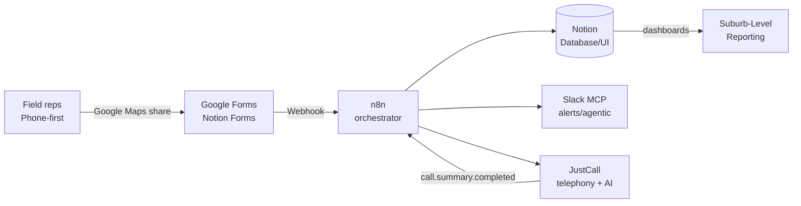

# Source — Kismet Phase 3 Stack Integration

> [!success] Canonical Phase 3 architecture
> This is the **authoritative technical blueprint** for the Door Knocking & Area Movement build (weeks 5-6). All current Kismet delivery work flows from this document.

**Original:** `sources/clients/kismet-finance/03092026-kismet-phase3-stack-integration.docx`
**Date:** 2026-03-09 · **Type:** Strategic architecture report, .docx, 3 MB

## Architecture at a glance

| Layer | Tool | Role |
|-------|------|------|
| Orchestration | n8n v2.0 | Central nervous system (decoupled save/publish, AI building) |
| Data + UI | Notion | Operational cockpit, single source of truth, **People / Household** records |
| Capture | Google Forms / Notion Forms (Typeform/Jotform v1.5) | Phone-first ingestion, max 5 qualitative questions |
| Comms | Slack with MCP Server | Agentic LLM access to channels/files, vs deterministic Web API |
| Telephony | JustCall v2 | Calls, AI Number Health & Smart Recommendations (Jan 2026) |

## Phase 3 mandate

- **Workflow:** Door Knocking & Area Movement
- **Hierarchy:** Campaign → Suburb → Street/Run, with status `Planned | Active | Completed`
- **Philosophy:** *phone-first*, native Google Maps only — no custom mobile app
- **Capture rule:** 5 qualitative questions max + auto-captured address, contact, rep ID, interest level
- **Output:** Suburb-Level Reporting dashboard driving resource allocation

## Regulatory anchors (Australia 2026)

> [!danger] Regulatory environment
> - **APRA CPS 230** — Operational risk management standard
> - **WA PRIS Act 2024** — commences **1 July 2026**. IPP 10 requires transparency + human-intervention for ADM (Automated Decision-Making). Offshore non-sovereign processing = breach.
> - **AUSTRAC Tranche 2** — AML/CTF reforms

All three force Australian data residency and auditable AI decisions.

## Notable architectural calls

- **n8n is the central nervous system**, not Notion's native automations (which have strict architectural limits — see doc §"Notion Cockpit").
- **Slack MCP Server** replaces traditional Slack Web API for agentic flows — native context, runtime tool discovery.
- **JustCall webhooks do NOT guarantee sequential delivery** — implement deduplication via the JustCall cryptographic ID property.
- **Notion data residency** flagged as a "highly complex variable" for AU firms — open architectural risk.

## Connections

- `[[wiki/clients/kismet-finance]]`
- `[[wiki/sources/kismet-tech-stack-overview]]` — companion simplified version, same date
- `[[wiki/sources/kismet-lowcode-stack-validation]]` — superseded predecessor (Airtable+Make)
- `[[wiki/sources/kismet-comp-101-training]]` — operationalizes the compliance side
- `[[wiki/projects/n8n-workflows]]` — delivery backbone
- `[[wiki/projects/automation-station]]` — portable form factor of the n8n core
